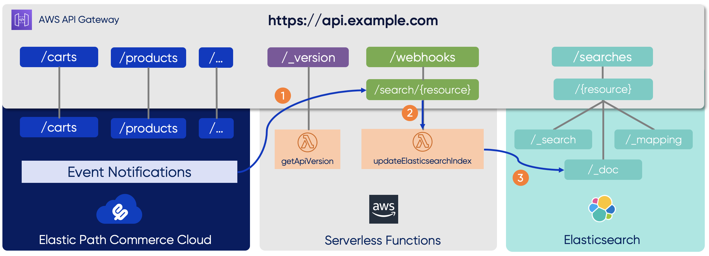

# Composable Commerce Reference

[](https://github.com/elasticpath/epcc-composable-commerce-reference)
[](https://www.gnu.org/licenses/gpl-3.0)
[](https://github.com/elasticpath/epcc-react-pwa-reference-storefront/issues)
[](#contributors-)
[](https://twitter.com/intent/follow?screen_name=elasticpath)

## Overview 🚀
The Elastic Path Commerce Cloud Composable Commerce Reference shows how to combine the business capabilities of Elastic Path Commerce Cloud with other services or packaged business components through a modular serverless application. The modules provided here for reference are:
* an Elasticsearch integration for indexing and searching catalog data,
* an API version resource showing the API's version and last deployment time.

Each module *independently* contributes to the API and infrastructure, therefore the project structure shown here can easily serve as a blueprint for building and deploying modular serverless applications.



The Elasticsearch integration works as follows:
1. Elastic Path Commerce Cloud is configured to send product change events to the new webhook endpoint `/webhooks/search/{resource}`.
1. When a product change event is received, the serverless Lambda function `updateElasticsearchIndex` is called.
1. The function creates the search document and updates the Elasticsearch search index accordingly by adding, updating, or deleting entries.

💡 &nbsp;Note that the `/searches` resource exposes the Elasticsearch APIs alongside the Elastic Path Commerce Cloud APIs.


## Documentation 📖

### API
Once deployed, this project will provide the following API:
```
/_version
/{store_id}/searches/{resource_name}
/{store_id}/webhooks/search/{resource_name}
/{store_id}/oauth
/{store_id}/products
/{store_id}/orders
/{store_id}/...
```
`{resource_name}` indicates a generic integration pattern. In this case only `products` are supported since the minimal implementation provided here only indexes product data. However, this can easily be extended to support other Elastic Path Commerce Cloud data such as categories, customers, orders etc.

### Prerequisites
Before you begin, ensure that you have the following configured:
- [Elastic Path Commerce Cloud account](https://dashboard.elasticpath.com/login)
- [Amazon Web Services account](https://aws.amazon.com/)
- [Elasticsearch](https://www.elastic.co/start) with basic authentication

### Development Tools
Building or extending the Composable Commerce Reference requires the following software:
- [Git](https://git-scm.com/downloads)
- [Node.js and npm](https://nodejs.org/en/download/)
- [AWS Command Line Interface 2.0.26 or later](https://aws.amazon.com/cli/)
- [Terraform 0.13.2 or later](https://www.terraform.io/downloads.html)

### Building and Deploying
```bash
# Clone the Git repository
git clone https://github.com/elasticpath/epcc-composable-commerce-reference.git

# Go into the cloned directory
cd epcc-composable-commerce-reference

# Install dependencies for all modules
npm install

# Configure the parameters in the file src/config/config.json.
# See section "Configuration Parameter Descriptions" below.

# Build and deploy
npm run start
```
`npm run start` will build the project, deploy infrastructure such as API gateway and Lambda functions into AWS, and configure Elastic Path Commerce Cloud with the appropriate integration webhook URL. Terraform will ask you to confirm before creating or destroying any infrastructure: typing in `yes` will confirm.

⚠️ &nbsp;**NOTE:** Depending on your useage, charges may occur when deploying infrastructure in AWS.

### Testing
Once everything is deployed and configured you can start the included integration test to ensure everything is working as expected:
```bash
npm run integration-test
```
### Cleanup
Use the following command to undeploy infrastructure and remove the configured integration webhook from Elastic Path Commerce Cloud:
```bash
npm run undeploy
```
### Available Scripts
`package.json` provides these scripts:
```
npm run start
npm run build       
npm run deploy
npm run config
npm run integration-test
npm run undeploy
npm run clean
```
`npm run start` is equivalent to the command `npm run build && npm run deploy && npm run config`.

Local unit tests can be run via `npm test`. 

### API Endpoint
```
https://<apigw_id_etc>.amazonaws.com/dev/<epcc_store_id>
```

## Configuration Parameter Descriptions ⚙️

Parameters that require configuration are in the `src/config/config.json` file:

|Parameter| Importance|Type|Description|
|--|--|--|--|
|`epcc_store_id`| Required| String| The store ID of your Elastic Path Commerce Cloud store|
|`epcc_client_id`| Required| String| A client ID for accessing your store|
|`epcc_client_secret`| Required| String| The client secret for the client ID|
|`elasticsearch_url`| Required | String | Elasticsearch endpoint that allows searching, configuration, and managing search documents|
|`elasticsearch_auth`| Required | String | Elasticsearch basic authentication, e.g. `"Basic dXNlcjpwYXNzdzByZA=="`|
|`api_version`| Required | String | API version, e.g. `"1.0.0"`|

✅ &nbsp;Basic authentication requires that user and password are Base64 encoded:
```
echo -n user:passw0rd | base64
```

## Contributing
This project follows the [all-contributors](https://github.com/all-contributors/all-contributors) specification. Contributions of any kind are welcome!

## Terms And Conditions
- Any changes to this project must be reviewed and approved by the repository owner. For more information about contributing, see the [Contribution Guide](https://github.com/elasticpath/epcc-composable-commerce-reference/blob/master/.github/CONTRIBUTING.md).
- For more information about the license, see [GPLv3 License](https://github.com/elasticpath/epcc-composable-commerce-reference/blob/master/LICENSE).